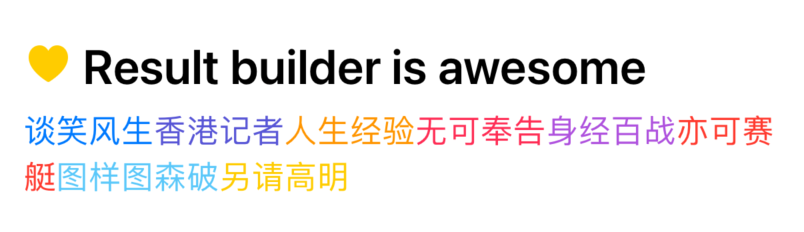

# AttributedText

An elegant way to build `NSAttributedString` like SwiftUI. 

Power by swift `Result Builder`


## Usage

```swift
let list = ["hello", "world"]

let attributedText: NSAttributedString = .Builder {
  "@resultBuilder".bold.italic.foreground(color: .purple)
  if #available(iOS 14, *) {
    "Wow".lineHeight(20)
  }
}
.build()
```


> Attachment and Loops

```swift
let list = ["谈笑风生", "香港记者", "人生经验", "无可奉告", "身经百战", "亦可赛艇", "图样图森破", "另请高明"]
textView.attributedText = .Builder {
  Group {
    attachment
    " Result builder is awesome\n".bold
        .fontSize(24)
        .foreground(color: .label)
  }
  .lineSpacing(8)

  for element in list {
    element.font(.systemFont(ofSize: 16))
        .foreground(color: .random)
        .lineSpacing(4)
  }
}
.build()
```



## Installation

### Swift Package Manager
* File > Swift Packages > Add Package Dependency
* Add https://github.com/octree/AttributedText.git
* Select "Up to Next Major" with "1.0.0"


## License

AttributedText is available under the MIT license. See the LICENSE file for more info.